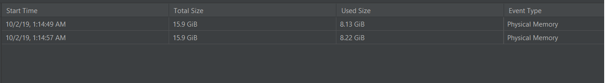
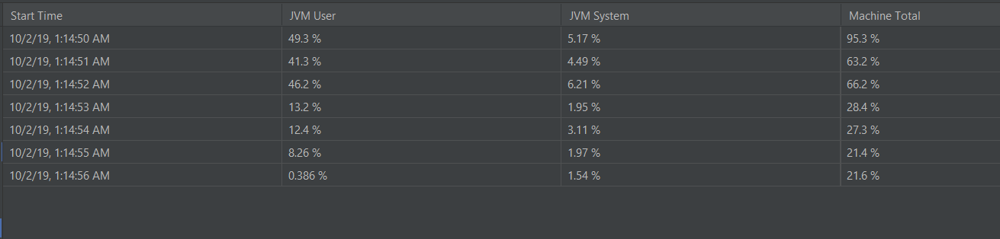

# GraphQL Client for GitHub
### By Abdullah Aleem
#### Object-oriented design and implementation of a [GraphQL](https://graphql.org/) client for [Github](https://github.com/) done using pure functional implementation.

## Overview

In this project I have implemented object oriented design of a program that extracts and organizes git repositories and user data from Github. Github Uses graphql which is a new technology released by Facebook. This project is implemented in scala which provides functionality of both object oriented and functional programming. I have tried to implement this homework using as many of these concepts as I could, given this was my first functional assignment. I haven't used variables anywhere and used lambda functions where ever I could.

## GitHub API

Firstly, you would need an access token from github which can be generated by following this tutorial:- https://help.github.com/en/github/authenticating-to-github/creating-a-personal-access-token-for-the-command-line

More information about the API is available at: https://developer.github.com/v4/  

I'd recommend getting familiar with the API using the GitHub Explorer: https://developer.github.com/v4/explorer  
You can read about how to use it over here: https://developer.github.com/v4/guides/using-the-explorer/

This should allow to give a basic idea of how the queries are formulated and what we get in repsonse. 

You can explore more about the GitHub Schema on this website: https://apis.guru/graphql-voyager/  
Change schema to GitHub at the top left corner. I found this graph extremly useful in explaining the relation between different objects. You can generate more advance queries with the help of this and test them using GitHub Explorer.


## Instructions


**Prerequisites** 

* JVM and SBT must be installed on your system.
* This project was done is Intellij Idea IDE. And can be easily loaded for proper project access.

**Add your GitHub Access Token**  

Once you have generated the your github access token you need to add it to the config file, which is located in src.main.resources folder.

**Running project using SBT**

* Clone or download this repository onto your system
* Open the Command Prompt (if using Windows) or the Terminal (if using Linux/Mac) and go to the project directory
* Build the project and generate the jar file using SBT

 ```
 sbt clean compile run
 ```


* To run the scalatest using SBT use


 ```
 sbt clean compile test
 ```


**Running project using Intellij Idea**

* Clone or download this repository onto your system
* Go to the project and open it using Intellij, or open Intellij and go to file and load the project.
* The entry point of the program is src->main->scala->Main. You can run this by right clicking the screen and clicking run Main.
* You can run the tests by navigating to src->test->scala. You can right click this folder and run all tests from different classes.


## Program Structure and Design

**Models**

The data models for this project are designed very similar to the data model for github server. The main models that I have designed are Repository (which has name, description, owner, diskUsage, isPrivate, updatedAt, primaryLanguage, languages, parents, isFork, forks). Similarly I have designed User, and Organization. All other models have one or two parameter e.g. Nodes that can contain a list of anyother data model. to mimic the data model for Github so It would be easy to parse and load this data locally. All these models have been defined using case class which offers great platform for designing such models. 
                                                                                                                                                
**Client**

I divided my client into three parts:-

1. DataGetter Object: This implements singleton design patterns and is only initiated once in the program. This takes the query and gets the results for this query from the server. This also inspects the query upon arrive if the status is ok.
2. ErrorChecker Class: A great thing about the Github Api is that if there is something wrong with the query it would give an error message telling what was wrong e.g. if a parameter wasn't provided correctly etc. These error message are different from null or bad request messages as they have useful info. The ErrorChecker Class check for this error before any operation could be performed. It also logs any error for the user could fix the query. This class in inherited by all other query clients (in 3) where they use if for any data operation.
3. Query Client: There are three query clients that I have implemented RepositoryQueries, UserQueries and SearchQueries. All these perform a certain set of operations (described later) e.g. the UserQueries class would perform user queries e.g. get the language the user is has used the most. All these classes inherits the ErrorCheck class and perform error checking before performing any operation.


## Implementation and Usage

**RepositoryQueries**

RepositoryQueries class is initiated with 2 parameters:- repository owner and repository name. This class handles functionality for given user. This class as of now has 4 functionality

1. checkLateForkUpdates(dueDate:String, dueTime:String):

    This method takes a date and time in zulu time and gives a list of all uses who had forked this library and made updates after the dueDate and dueTime. This idea behind this was to find a very fast way to figure out who has submitted their homework late (as opposed to checking each link). It can also be used to find out who is working on the fork lately.
    
2. getUsedLanguages(): 

    This returns the list of all languages that are used in the repository. Takes no params.
    
3. getNumberOfLanguagesUsed():
    
    This returns the number of languages that are used in the repository
    
4. getLastForks(number: Int):

    This returns a list (length = number) of people who last forked this repository.
    
     
     

**UserQueries**

UserQueries class is initiated with 1 parameters:- User login. This class handles functionality for given user. This class as of now has 4 functionality

1. getAllLanguages():

    This method returns all the languages that the user has worked on his profile. This iterates over all this repositories and extracts unique languages that he has used. This can used to find users that have a certain set of languages the recruiter might be looking for. 
        
2. getPrimaryLanguage(): 

    This returns the language the user is most proficient in or he has used the most.
    
3. getOriginalRepositories():
    
    Returns the total number of original repositories that the user has created. Fork repositories not included.
    
4. getTotalRepositories():

    Gets the total Number of Repositories that the user has created. Original plus Forked

    

**SearchQueries**

SearchQueries class is initiated without any parameters:- This class handles functionality for a given search parameter. This class as of now has 1 functionality

1. mostUsedLanguage(searchParam: String):

    This method take a string parameter e.g. "machinelearning" and returns the map of the most used languages for that query. The map has language name and number of times it appeared in the first 100 search results. 
     


## Testing

The tests for this project can be run using

 ```
 sbt clean compile test
 ```

or navigating to tests in Intellij and run and right clicking the folder to run them all. 

There are 6 tests that I have designed in this project. The first test checks the data getter.  The next two tests checks the models and if they are formed correctly. The last three tests test the functionality for RepositoryQueries and UserQueries methods. These tests with detailed explanations can be found in scala->tests->main

## Design Patterns Implemented

The two design patterns that I have used for this project are Singleton and Facade. Below is brief explanation of how I have used them and how they helped me.

* Singleton
    
    I implemented this design pattern for DataGetter. DataGetter is created as an object in the client class. This object takes a query and fetches the result from the github server. This DataGetter has same functionality throughout the project. Is used in tests and DataQuery Classes. Implementing this a singleton allows up to prevent creating multiple instances of this to avoid memory waste and to potentially avoid simultanious calls to the server.
    
    
* Facade

    I implemented this design for repository, user and search query. They access the functions for ErrorChecker and DataGetter and their own private functions for data processing but this is not exposed to the used that creates the instances of these class. This allows the user a simple interface and he doesn't have to deal with DataGetter and ErrorChecking.
        


## Runtime evaluation

I have used the Java Flight Recorder for the evaluation of this project where I run all the tasks and calculate the memory and cpu usage. 


**Physical Memory Used**


**CPU Load**

